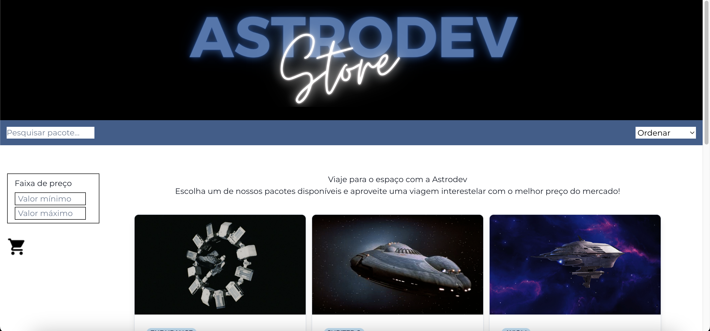
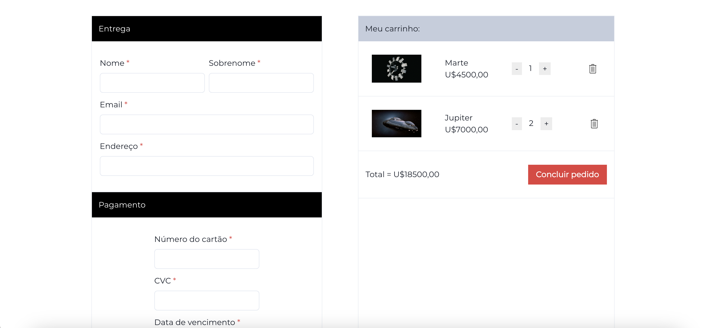

# **Projeto Astrodev Store**

O projeto é um site de venda de viagens espaciais que possui duas páginas: Home e Checkout. O projeto terá como fonte de dados uma array fictícia de viagens espaciais. Esse projeto foi desenvolvido como parte do bootcamp Labenu.

## 🔍 **Índice**
- <a href="#funcionalidades">Funcionalidades do projeto</a>
- <a href="#layout">Layout</a>
- <a href="#demonstracao">Demonstração</a>
- <a href="#rodar">Como rodar esse projeto?</a>
- <a href="#tecnologias">Tecnologias utilizadas</a>
- <a href="#autoras">Pessoas autoras</a>

## 💻 **Funcionalidades do projeto**
- [x] Lista na página inicial com produtos
- [x] Filtros: nome, menor valor e valor máximo
- [x] Botão de adicionar o item ao carrinho
- [x] Carrinho: aumentar/diminuir quantidade de produtos, excluir produto, ir para a página de Checkout
- [x] Página de Checkout com formulários de cadastro e pagamento

## 🖼 **Layout**



## 🎯 **Demonstração**
[Link demonstração](https://astrodev-store.surge.sh/)

## 🕹 **Como rodar esse projeto?**

```
# Clone esse repositório
$ git clone link-repositorio

# Acesse a pasta do projeto no seu terminal
$ cd projeto-astrodev

# Instale as dependências
$ npm install 

# Execute a aplicação
$ npm run dev

```

## ⚙️ **Tecnologias utilizadas**

1. [React](https://pt-br.reactjs.org/)
2. [React Router](https://reactrouter.com/)
3. [Styled-components](https://styled-components.com/)


## 👩🏻‍💻 **Pessoas autoras**


[Linkedin](https://www.linkedin.com/in/mariaconstance/)

